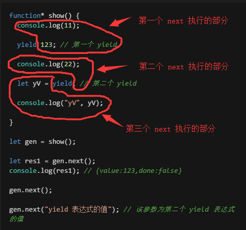

# ECMAScript 6 (es2015)

- ECMAScript 标准
- javascript 语言（实现）
- 适用高级浏览器——不兼容 -> 编译

## 变量

| es5                                                             | es6                                                                     |
| --------------------------------------------------------------- | ----------------------------------------------------------------------- |
| var                                                             | let(变量) const(常量)                                                   |
| 缺点:<br>1.重复定义不报错<br>2.没有块级作用域<br>3.不能限制修改 | 解决:<br>不能重复定义<br>有块级作用域->花括号<br>const 是常量，不能修改 |

## 函数 + 参数

- 箭头函数 —— 简写

  1.  只有一个参数，`()` 可以省略
  2.  只有一个语句，还是 return , `{}` 可以省略

```javascript
// 数组排序
let arr = [12, 3, 5, 19];
arr.sort((a, b) => a - b);
console.log(arr); // [3, 5, 12, 19]
```

- 参数扩展——剩余参数（Rest Parameter）

```javascript
function show(a, b, ...args) {
  console.log(args);
}

show(13, 3, 1, 2, 3); // 1,2,3
```

- 展开数组

```javascript
let arr = [1, 2, 3];

// ...arr 等价于 1,2,3

function sum(a, b, c) {
  console.log(a + b + c);
}

sum(...arr); // 6
```

## 字符串

- 两个新方法

  - startsWith() 以...开头

```javascript
    if (str.startsWith('http://')) {
        console.log('普通网址');
    } eles if (str.startsWith('https://')) {
        console.log('加密网址');
    } else if (str.startsWith('git://')) {
        console.log('git 地址');
    } else if (str.startsWith('svn://')) {
        console.log('svn 地址');
    }
```

- endsWith() 以...结尾

```javascript
// 根据文件名的后缀判断文件类型
const str = "a.txt";
if (str.endsWith(".txt")) {
  console.log("文本文件");
}
```

- 字符串模板

  - 用法：

    - 反单引号 `

    - 字符串变量：`${变量名}`


    ```javascript
    const a = 123;
    console.log(`abc${a}`); // abc123
    ```

- 优点：

  - 直接把变量放到字符串中

  - 支持换行

    ```javascript
    // es6 前字符串换行报错
    // es6 前字符串拼接最好用 array.join() 方法
    `<div>
            <span>11111</span>
        </div>`;
    ```

## 解构赋值

- 使用条件

  - 左右两边的解构必须一样

  - 右边必须是个值

  - 声明和赋值不能分开（须在同一行）

- 案例

  ```javascript
  // 数组
  let [a, b, c] = [1, 2, 3];
  console.log(a, b, c); // 1 2 3

  // 对象
  let { a, b } = { b: 2, a: 1 };
  console.log(a, b); // 1 2

  // 函数参数的解构赋值
  function fn(obj) {
    console.log(obj.name);
  }

  // 等价于
  function fn({ name }) {
    console.log(name);
  }

  fn({ name: "hopper" });
  ```

## 数组

- map : 映射 -> 一个对一个

  ```javascript
  let arr = [1, 2, 3, 4];
  let arr2 = arr.map(item => item * 2);
  console.log(arr2); // 2,4,6,8
  ```

- reduce : 汇总

  ```javascript
  let arr = [1, 2, 3, 4, 5];
  /*
    tmp: 上一次回调返回累积值
    item: 数组中正在处理的元素
    index(可选): 数组中正在处理的当前元素的索引
   */
  let total = arr.reduce((tmp, item, index) => tmp + item);
  console.log(total); // 15

  // 求平均数
  let average = arr.reduce((tmp, item, index) => {
    if (index < arr.length - 1) {
      return tmp + item;
    } else {
      return (tmp + item) / arr.length;
    }
  });
  ```

- filter : 过滤（保留回调返回 true 的）

  ```javascript
  // 输出奇数
  let arr = [1, 2, 3];
  let odd = arr.filter(item => item % 2);
  console.log(odd);
  ```

- forEach : 迭代、遍历

  ```javascript
  let arr = [1, 2, 3];
  arr.forEach((item, index) => {
    console.log(`第${index}个是${item}`);
  });
  ```

## Module 模块化

- 由两个命令构成：export 和 import

- export: 规定模块的对外接口

- import: 输入其他模块提供的功能

### export 命令

- 一个模块是一个独立的文件，内部的所有变量，外部无法读取，须使用 export 关键字输出变量

- 输出方式

```javascript
    // 1. 输出变量
    export var name = 'hopper';
    export var age = 20;
    // 等价于
    var name = 'hopper';
    var age = 20;
    export {name,age};  // 推荐

    // 2. 输出函数或类（class）
    export function sum(x,y){
        return x + y;
    }

    // 3. 使用 as 关键字重命名
    function v1 {...}
    export {
        v1 as aaa;
        v1 as bbb;  // v1 可以用不同的名字输出两次
    }
```

- 注意：

  - export 输出的对外接口，必须与模块内的变量建立一一对应的关系

```javascript
// 报错
export 1;   // 直接输出1

// 报错
var m = 1;
export m;   // 通过 m 变量直接输出 1 ， 不是接口

// 正确写法
// 写法 一
export var m = 1;

// 写法 二
var m = 1;
export {m};

// 写法 三
var n = 1;
export {n as m};

// 以上三种方法规定了对外的接口 m ; 实质：在接口名和模块内部变量之间，建立了一一对应的关系. 函数和类的输出，也要遵循这种写法
```

- export 命令可以出现在模块的任意位置，但必须处于模块的顶层

### import 命令

- export 命令定义了模块的对外接口，通过 import 命令加载这个模块

- 输入的变量都是只读，本质是输入接口

- from 路径：

  - 可以是相对路径，也可以是绝对路径，.js 后缀可以省略

  - 如果只是模块名，不带有路径，那么必须有配置文件，告诉 js 引擎该模块的位置

```javascript
import { method } from "Utils";

// Utils 是模块文件名，由于不带路径，须有配置文件
```

- 模块的整体加载

  - 用 \* 指定一个对象，模块输出的所有值都加载这个对象上

```javascript
// circle.js
// 输出 area 和 circumference

export function area(r) {
  return Math.PI * r * r;
}

export function circumference(r) {
  return 2 * Math.PI * r;
}
```

```javascript
// main.js

import { area, circumference } from "./circle";

console.log("圆面积", area(4));
console.log("圆周长", circumference(4));
```

```javascript
    // 整体加载
    // 注：整个 circle 对象是静态分析，不允许运行时改变

    import * as circle from './circle'

    console.log('圆面积'，circle.area(4));
    console.log('圆周长'，circle.circumference(4));
```

## 面向对象（es6）

- es6 之前的面向对象：定义一个函数，函数名既是类又是构造函数

- es6 引入一个关键字 class，用于定义一个类

  - class

  - super

  - extends

  ```javascript
  // user 类
  class user {
    // 构造函数
    constructor(name, password) {
      this.name = name;
      this.password = password;
    }

    // 方法
    login() {
      console.log("登录成功");
    }
  }
  let u = new user("hopper", 123456);
  u.login(); // 登录成功
  ```

- class 继承

  ```javascript
  // user 类
  class user {
    // 构造函数
    constructor(name, password) {
      this.name = name;
      this.password = password;
    }

    // 方法
    login() {
      console.log("登录成功");
    }
  }

  // vipUser 继承 user
  // 子类大于父类：父类有的，子类一定有；子类有的，父类未必有
  class vipUser extends user {
    constructor(name, password, level) {
      super(name, password); // 调用父类的 constructor

      this.level = level;
    }

    logout() {
      console.log("退出登录");
    }
  }

  let vU = new vipUser("hopper1", 654321, 9);
  console.log(vU.name); // hopper1
  console.log(vU.password); // 654321
  console.log(vU.level); // 9
  vU.login();
  vU.logout();
  ```

## Promise 解决异步操作(回调地狱)

- 同步：只有操作完成了，才能执行下一次操作。一次只能做一个事

  - 优势：简单

- 异步：这个操作进行中，其它操作也能开始。一次可以做多个事

  - 优势：

    1.  用户体验好

    2.  高效

- Promise —— 状态机

  - 创建 Promise 对象

    ```javascript
    let p = new Promise((resolve, reject) => {
      异步代码;
    });
    ```

  - 使用 Promise 对象

    ```javascript
    p.then(() => {}, () => {});
    ```

```javascript
let p = new Promise((resolve, reject) => {
  // resolve -> 解决
  // reject -> 拒绝

  // 异步操作
  $.ajax({
    url: "",
    success(data) {
      resolve(data);
    },
    error(err) {
      reject(err);
    }
  });
});

let p1 = new Promise((resolve, reject) => {
  // resolve -> 解决
  // reject -> 拒绝

  // 异步操作
  $.ajax({
    url: "",
    success(data) {
      resolve(data);
    },
    error(err) {
      reject(err);
    }
  });
});

let p2 = new Promise((resolve, reject) => {
  // resolve -> 解决
  // reject -> 拒绝

  // 异步操作
  $.ajax({
    url: "",
    success(data) {
      resolve(data);
    },
    error(err) {
      reject(err);
    }
  });
});

p.then(
  arr => {
    // 成功的回调
  },
  err => {
    // 失败的回调
  }
);

// p,p1,p2都执行完成，才会调用 then
Promise.all([p, p1, p2]).then(
  arr => {
    // arr: p,p1,p2 三个结果的数组
  },
  err => {}
);
```

- 新版 jq 的 ajax 的返回值是一个 Promise

```javascript
Promise.all([
  $.ajax({ url: "" }),
  $.ajax({ url: "" }),
  $.ajax({ url: "" })
]).then(arr => {}, err => {});
```

- 配合 generator 和 async\* 使用

## generator （参照 [generator.html](./generator.html)）

- 普通函数：一直执行到底

- generator: 中间可以暂停

```javascript
/*
  三要素：
    1. 定义 *
    2. 暂停 yield
    3. 执行 next()
*/

// 定义，使用 *
function* show() {
  console.log(1);

  yield; // 暂停

  console.log(2);
}

let gen = show(); // 调用 generator 函数不会执行，而是生成一个 generator 对象

// 调用 next() 一次执行一下；从 generator 函数的初始位置开始执行
gen.next(); // 1
gen.next(); // 2
```

- 重要元素说明

  - yield

    - 传参：参数通过 next 方法传递进来，注意：next 方法的参数表示上一个 yield 表达式的值

    - 返回值：yield 右边的值就是 next() 的返回值

    ```javascript
    function* show() {
      console.log(11);

      yield 123; // 第一个 yield

      console.log(22);

      let yV = yield; // 第二个 yield

      console.log("yV", yV);
    }

    let gen = show();

    let res1 = gen.next();
    console.log(res1); // {value:123,done:false}

    gen.next();

    gen.next("yield 表达式的值"); // 该参数为第二个 yield 表达式的值
    ```

  - next

    - 执行逻辑：每个 next 的调用会执行到对应 yield 的右边才停止

      

- 应用场景：需要等待某些操作（如：数据交互）执行完成，才执行后续的操作

  ```javascript
  // 结构：类似同步操作；但执行的是异步操作
  function* show() {
    // 操作1
    // 操作2

    let data1 = yield $.ajax("a.txt");

    // 操作3
    // 操作4
    let data2 = yield $.ajax("b.txt");

    // 操作5
  }
  ```

  - 配合 `yield-runner-blue` 模块使用

    ```javascript
    // generator 的匿名函数不能是箭头函数，必须是 function 函数

    runner(function *() {
      
    });
    ```

## async/await 

- generator 只是一个过渡，开发过程中推荐使用：async/await + promise

---

- 说明：generator 实际应用时需要依赖 runner ，无法确定市面上哪个 runner 是最好的，因此 es 官方推出了 async/await ，即官方版的 runner

- async 函数：generator 函数的语法糖

```javascript
// generator 函数
function* show(){
  console.log(111);
  yield 222;
  console.log(333);
}

// async 函数
async function show(){
  console.log(111);
  await 222;
  console.log(333);
}

// * -> async
// yield -> await
```

- async 函数对 generator 函数的改进

  1.  内置执行器

      - generator 函数：执行必须靠执行器，即需要调用 next 方法

      - async 函数：自带执行器，与普通函数一样，调用一次，就会自动执行，输出最后的结果

  2.  更好的语义

      相对星号和 yield ，async 和 await 的语义更清楚。

      - async 表示函数里有异步操作

      - await 表示紧跟在后面的表达式需要等待结果

  3.  更广的适用性

      - yield 后面只能是 Thunk 函数和 Promise 对象

      - await 后面可以是 Promise 对象和原始类型的值（这时等于同步操作）

  4.  返回值是 Promise

      - generator 函数返回值是 iterator 对象

      - async 函数返回值是 Promise 对象，能调用 then 方法

  注：async 函数可以是箭头函数

- promise、generator 和 async 的区别

||promise|generator|async|
|---|---|---|---|
|本质|等待异步操作结束|无感处理异步操作|官方 runner |

  - 写法

    ```javascript
      // promise
      new Promise((resolve,reject)=>{
        // 异步操作
      }).then(()=>{
        // 异步完成后执行
      })

      // generator
      runner(function* (){
        // do something

        let res1 = yield $.ajax();

        // do something

        let res2 = yield $.ajax();

        // end
      })

      // async
      (async ()=>{
        // do something

        let res1 = await $.ajax();

        // do something

        let res2 = await $.ajax();

        // end
      })();
    ```