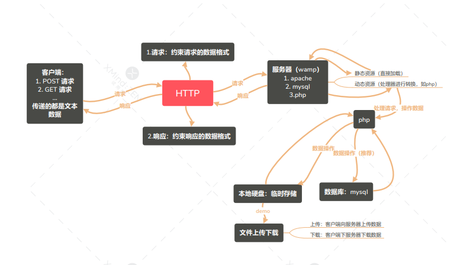

# HTTP 协议

- 超文本传输协议

- 规范，约束双方。约束的是浏览器客户端和服务器通讯的一个标准。

- 客户端和服务器进行交互，交互的目的是传递数据，基于请求和响应

- http 协议是约束客户端和服务器传递的数据格式

### 请求数据：客户端（浏览器）进行数据组装。 客户端 -> 服务器

- 请求首行

- 请求头

- 请求空行

- 请求体

#### GET 请求数据格式 （request）

1.  请求首行

    `GET /day_02/code/01_fileupload.html?username=zhangsan&age=11 HTTP/1.1`

    - `/day_02/code/01_fileupload.html` 根据地址去找服务器上面的资源

    - `HTTP/1.1` 协议的版本

2.  请求头 -> GET 请求，数据放在 url 上，因此没有请求体

    - 主机地址

      `Host 88.128.18.51`

    - [自动升级请求从 http 到 https](https://segmentfault.com/q/1010000005875125?_ea=937051)

      `Upgrade-Insecure-Requests 1`

    - 告诉服务器客户端浏览器的版本，以及操作系统的版本

      `User-Agent Mozilla/5.0 (Windows NT 6.1; Win64; x64) AppleWebKit/537.36 (KHTML, like Gecko) Chrome/67.0.3396.87 Safari/537.36`

    - 告诉服务器，客户端接收的数据格式

      `Accept text/html,application/xhtml+xml,application/xml;q=0.9,image/webp,image/apng,*/*;q=0.8`

    - 告诉服务器，请求来自哪个页面

      `Referer http://88.128.18.51/day_02/code/`

    - 接收服务器的压缩类型

      `Accept-Encoding gzip, deflate, br`

    - 接收语言

      `Accept-Language zh-CN,zh;q=0.9,ko;q=0.8,zh-HK;q=0.7`

    - 版本匹配

      `If-None-Match "2a000000005186-273-56efe0a46c0d8"`

    - 修改

      `If-Modified-Since Tue, 19 Jun 2018 12:44:16 GMT`

#### POST 请求数据格式 （request）

1.  请求首行

    `POST /day_02/code/api/02_post.php HTTP/1.1`

2.  请求头。名称和值

    - `Host 88.128.18.51`

    - `Content-Length 15` 内容长度

    - `Cache-Control max-age=0` 缓存

    - POST 提交有一个默认的请求头

      `Content-Type application/x-www-form-urlencoded`

3.  请求空行

4.  请求体：请求发送的数据部分

### 响应数据。 服务器 -> 客户端

1.  响应首行

    `HTTP/1.1 200 OK`

2.  响应头

    - 服务器的事件

      ```
          Date	Tue, 19 Jun 2018 13:45:04 GMT
          Server	Apache/2.2.21 (Win32) PHP/5.3.10
      ```

    - 文件的最后修改文件

      `Last-Modified Tue, 19 Jun 2018 13:30:43 GMT`


    - 文件的版本.

        ```ETag	"3600000000518d-253-56efeb066168b"```

    - 字节

        ```Accept-Ranges	bytes```

    - 告诉客户端浏览器，响应体的长度.

        ```Content-Length	595```

    - 响应的数据格式

        ```Content-Type	text/html```

3.  响应空行

4.  响应体（response）

    ```
        <!DOCTYPE html>
        <html lang="en">
        <head>
            <meta charset="UTF-8">
            <title>Title</title>
        </head>
        <body>
                <!--
                文件上传客户端的处理
                        1:文件上传必须表单提交
                        2：必须是post 方式提交
                        3：表单属性  encType="multipart/form-data"
                        4：input type="file"
                -->
                <form action="./api/02_post.php" method="post">
                    照片:<input type="text" name="lifephoto"> <br> <br>
                        <input type="submit" value="上传">
                </form>
        </body>
        </html>
    ```

### HTTP 数据解析流程


- http 协议约束了`请求数据`和`响应数据`的数据格式

### GET 和 POST 区别

| GET                                | POST                                                                                                                                               |
| ---------------------------------- | -------------------------------------------------------------------------------------------------------------------------------------------------- |
| 发送/请求的数据在地址栏中，不安全  | 发送的数据在请求体中，相对安全                                                                                                                     |
| 数据在地址栏中，对数据的大小有限制 | 请求的数据大小没有限制（相对），文件上传必须得用 post                                                                                              |
| 有缓存                             | 没有缓存                                                                                                                                           |
| 数据在地址栏中，没有请求体         | 数据在请求体中，有一个特数据的请求头 [Content-Type:application/x-www-form-urlencoded](https://imququ.com/post/four-ways-to-post-data-in-http.html) |
| 请求头相对较少，性能稍微高一些     |                                                                                                                                                    |

### 状态码

| 状态码 | 说明       |
| ------ | ---------- |
| 1xx    | 消息       |
| 2xx    | 成功       |
| 3xx    | 重定向     |
| 4xx    | 客户端错误 |
| 5xx    | 服务器错误 |

- 常用

  - 200 代表 ok ,响应成功

  - 404 请求资源没有找到，请求路径写错出现这样的问题

  - 500 服务器内部错误

  - 304 请求的文件没有改变

  - 302 请求重定向

## 前后端交互完整流程



## http2(实验性)

1.  强制使用 https

2.  性能更高。面向流（之前的是面向字节）、头压缩、多路复用

3.  双向通信-服务器推送

## ajax2.0 IE10+

```javascript
// ajax 版本判断
if (xhr.upload) {
  console.log("ajax 2.0");
} else {
  console.log("ajax 1.0");
}
```

| 1.0                | 2.0                                                           |
| ------------------ | ------------------------------------------------------------- |
| xhr.send('字符串') | 1. xhr.send(formData); 2. xhr.send(Blob); 3. xhr.send(Buffer) |

1.  Formdata 容器 -> post 请求

    - set: 添加值

    - append：追加值

    - get

```javascript
new FormData();
```

2.  文件上传，上传进度监控

    - 传输 input 控件: `formData.set('名字',<input type='file'/>)`

    - xhr.upload 事件

      - xhr.upload.onload 上传完成

      - xhr.upload.onprogress 进度变化

        - ev.loaded 已加载的进度

        - ev.total 总的进度

3.  CORS 跨域 -> 协议、主机、端口

    - 报错

    `No 'Access-Control-Allow-Origin' header is present on the requested resource. Origin 'null' is therefore not allowed access.`

    - ajax 能跨域，因为响应头： `Access-Control-Allow-Origin`

    - node 服务设置

    ```javascript
    res.setHeader("Access-Control-Allow-Origin", "*");
    ```

    - ajax2.0 相对于 ajax1.0 的请求头多一个 `origin` 字段

      - origin 代表浏览器的请求是哪个域

      - 服务器的正确操作：通过判断 origin ，如果是项目自己允许的域，则设置允许跨域

        ```javascript
        if (req.headers["origin"] === "xxx") {
          res.setHeader("Access-Control-Allow-Origin", "*");
          res.write("");
          res.end();
        }

        // 多个域

        let allowHosts = ["baidu.com", "taobao.com"];
        if (allowHosts.indexOf(req.headers["origin"]) != -1) {
          res.setHeader("Access-Control-Allow-Origin", "*");
          res.write("");
          res.end();
        }
        ```

## jsonp 跨域（废弃） 不官方

- 通过 script 的 src 访问资源。script 访问资源不跨域

- 资源地址带有一个 cb/callback 的参数名，参数名有前后端约定，一般为 callback ，参数值为函数名，具体的函数在前端定义好，后端返回该函数的调用，把需要响应的数据作为函数的参数。

  - 前端可以获取请求的数据

- jquery -> dateType:'jsonp'
